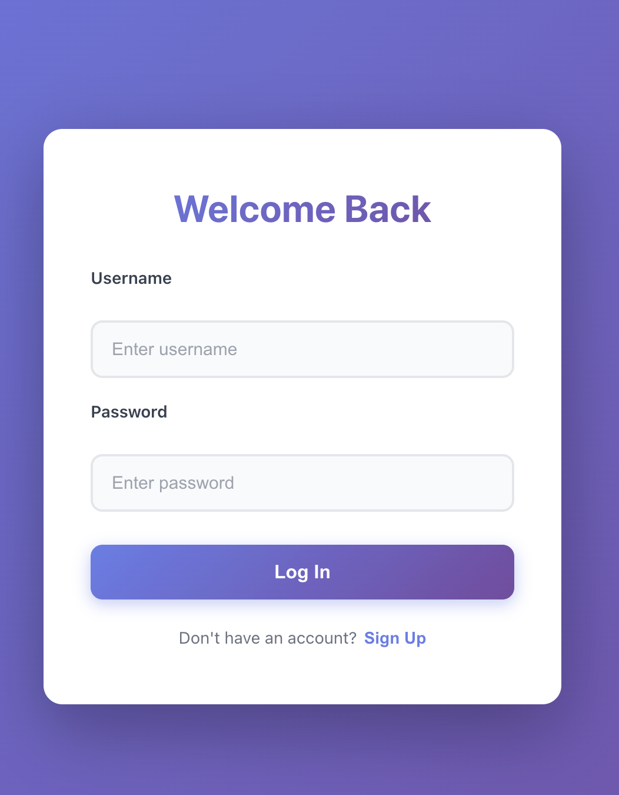
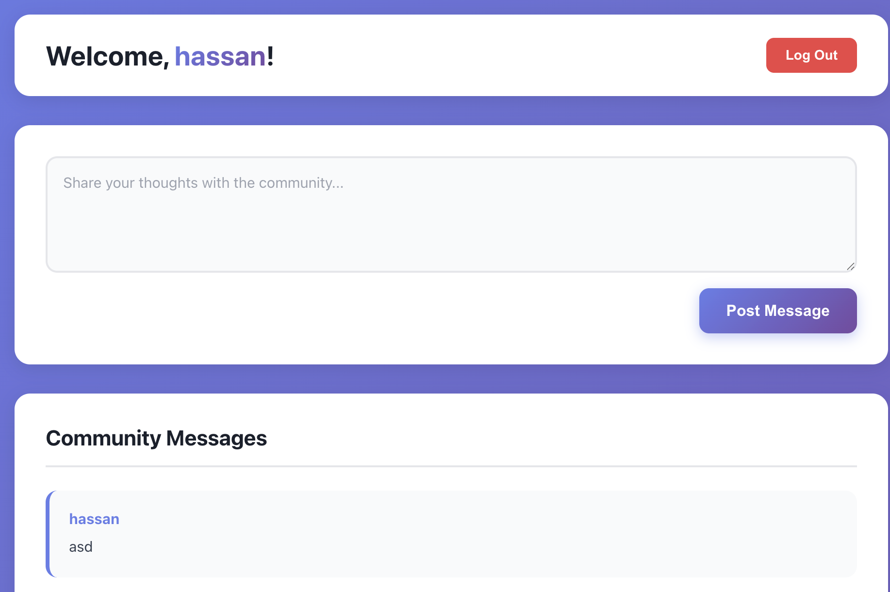

# Members Authenticator

A full-stack authentication web app with messaging features.
Built with React, Express.js, Passport.js, PostgreSQL, and Render for deployment.

------------------------------------------------------------

## Features

- User registration & login (Passport Local Strategy)
- Secure password hashing (bcrypt)
- Session-based authentication with cookies
- Postgres database storing users & messages
- React frontend with protected routes
- Fully deployable on Render

------------------------------------------------------------

## Tech Stack

Frontend: React, Vite
Backend: Node.js, Express.js, Passport.js
Database: PostgreSQL
Deployment: Render

------------------------------------------------------------

# Working Project






------------------------------------------------------------

# Running the Project Locally

Below are the full steps to set up the backend, frontend, and database on your computer.

------------------------------------------------------------

# 1. Install Dependencies

## Install server dependencies
```
cd server
npm install
```
## Install client dependencies
```
cd ../client
npm install
```
------------------------------------------------------------

# 2. Set Up PostgreSQL Locally

Make sure PostgreSQL is installed.

## Create a database:
```
CREATE DATABASE users;
```
## Create the tables:

```
CREATE TABLE users (
  id SERIAL PRIMARY KEY,
  username TEXT UNIQUE NOT NULL,
  password TEXT NOT NULL
);

```CREATE TABLE messages (
  id SERIAL PRIMARY KEY,
  user_id INTEGER REFERENCES users(id),
  message TEXT NOT NULL,
  created_at TIMESTAMP DEFAULT NOW()
);
```

------------------------------------------------------------

# 3. Create a .env file (Backend)

Inside /server, create:
```
PG_HOST=localhost
PG_USER=your_postgres_user
PG_PASSWORD=your_postgres_password
PG_PORT=5432
PG_NAME=users

SESSION_SECRET=your-secret
CLIENT_URL=http://localhost:5173
```
------------------------------------------------------------

# 4. Start the Backend
```
cd server
npm run dev

Backend runs on:
http://localhost:5001
```
------------------------------------------------------------

# 5. Start the Frontend
```
cd client
npm run dev

Frontend runs on:
http://localhost:5173
```

# Authentication Notes

The backend uses:

- Passport LocalStrategy
- bcrypt password hashing
- express-session
- cookie-based login persistence

------------------------------------------------------------

